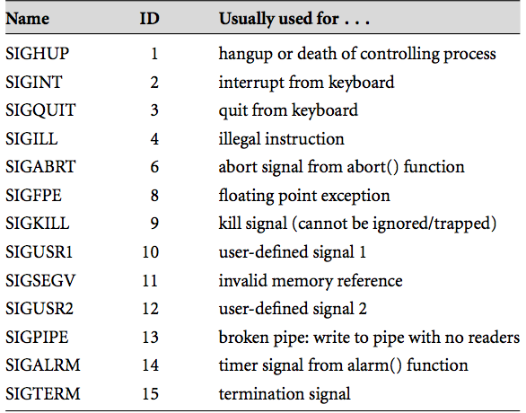

#COMP2401 Final Review
-----
By: Seena Rowhani
System's Programming
---
**Responsibilities of the OS**

1. Handle interrupts generated by I/O controllers
2. Manage hardware resources, including processing, memory distribution, data storage, and I/O devices
3. Provide services to applications
4. Go Between for applications and computer resources

**Virtual Memory**

It's a memory management technique that maps memory addresses used by the program, known as **virtual addresses**, into **physical addresses** in the physical memory.

Basics of Programming
---
###Operators

1. Arithmetic

		+,-,/,*
2. Relational
		
		<, >, >=, <=
3. Logical

		NOT -> !
		AND -> &&
		OR  -> ||	
4. Bitwise
		
		NOT    -> ~
		AND    -> &
		OR     -> |
		XOR    -> ^
		LShift -> <<
		RShift -> >>

5. Conditional

		boolean ? a : b
6. Assignment

		=,+=,-=,*=,/=,%=,&=,|=,^=, etc
		
###Variables, and Primitive Data Types
**Integer Types**

<table>
<tr><th>Type</th><th>Storage size</th><th>Value range</th></tr>
<tr><td>char</td><td>1 byte</td><td>-128 to 127 or 0 to 255</td></tr>
<tr><td>unsigned char</td><td>1 byte</td><td>0 to 255</td></tr>
<tr><td>signed char</td><td>1 byte</td><td>-128 to 127</td></tr>
<tr><td>int</td><td>2 or 4 bytes</td><td>-32,768 to 32,767 or -2,147,483,648 to 2,147,483,647</td></tr>
<tr><td>unsigned int</td><td>2 or 4 bytes</td><td>0 to 65,535 or 0 to 4,294,967,295</td></tr>
<tr><td>short</td><td>2 bytes</td><td>-32,768 to 32,767</td></tr>
<tr><td>unsigned short</td><td>2 bytes</td><td>0 to 65,535</td></tr>
<tr><td>long</td><td>4 bytes</td><td>-2,147,483,648 to 2,147,483,647</td></tr>
<tr><td>unsigned long</td><td>4 bytes</td><td>0 to 4,294,967,295</td></tr>
<table>

<strong>Floating Point Types</strong>

<table>
<tbody><tr><th>Type</th><th>Storage size</th><th>Value range</th><th>Precision</th></tr>
<tr><td>float</td><td>4 byte</td><td>1.2E-38 to 3.4E+38</td><td>6 decimal places</td></tr>
<tr><td>double</td><td>8 byte</td><td>2.3E-308 to 1.7E+308</td><td>15 decimal places</td></tr>
<tr><td>long double</td><td>10 byte</td><td>3.4E-4932 to 1.1E+4932</td><td>19 decimal places</td></tr>
</tbody>
</table>

###Passing By Value vs. Reference

Passing by reference is when you supply a pointer to a data type to a function. This allows for **return parameters**

**Arrays in C are actually just pointers**

So when you do something like this:

	#include<stdio.h>
	
	void test(char *);
	
	int main(){
		char b[1];
		b[0] = '1';
		test(b);
		printf("%c\n", b[0]);
		return 0;
	}

	void test(char *a){
	 	a[0] = '2';
	}
	

Your output is going to look like this:

	2
	
**Parameter Types**
	
	Input : Makes use of its value
	Output: Uses variable to output
	Both  : Does both

Primitive Data Types
---

__Bit Models__

- __Magnitude Only__
	- Only positive integers
	- Each 1 or 0 at a given `i` represents <code>{1 || 0} * 2i</code>
	- Goes right to left
	
			Drawbacks:
				1. Cannot express negative numbers
		
- __Sign Magnitude__
	- The highest order bit is the *sign* bit.
	- `0 indicates +`
	- `1 indicates -`
	
			Drawbacks:
				1. Two values for zero (+/-).
				2. Addition becomes complicated, because if we add a positive and a negative number we must subtract instead.
- __Two's Complement__
	1. Write the bits for the positive version of the number
	2. Invert all the bits
	3. Add 1
	
			Two's Complement in C
				1. char (-128 to 127)
				2. int
				3. short
	
	**Note**
	
	The bit patterns for both −127 and −126 were computed normally (the reader is encouraged to work these out). Both of these values are fine; the two’s com- plement bit model can represent them using 8 bits. However, the result of the addition is 00000011, which equates to 3 in base 10. This is of course wrong. What has happened is that an overflow has occurred. With 8 bits, __we cannot represent −253__ (it is outside of the allowed range of −128 to +127). We can see that an overflow has occurred by looking at the highest two carry bits, which in this example are 10.
	
	*This can be described as an __Arithmetic Overflow__*
	
	Test 1 **Questions b and c**
	

=
- Floating Point Bit Model

<table class="tg">
  <tr>
    <th class="tg-031e">Data Type</th>
    <th class="tg-031e">sign (bits)</th>
    <th class="tg-031e">exponent (bits)</th>
    <th class="tg-031e">fraction (bits)</th>
    <th class="tg-031e">Total</th>
  </tr>
  <tr>
    <td class="tg-031e">float</td>
    <td class="tg-031e">1</td>
    <td class="tg-031e">8</td>
    <td class="tg-031e">23</td>
    <td class="tg-031e">32</td>
  </tr>
  <tr>
    <td class="tg-031e">double </td>
    <td class="tg-031e">1</td>
    <td class="tg-031e">11</td>
    <td class="tg-031e">52</td>
    <td class="tg-031e">64</td>
  </tr>
</table>

	Base 10 to Base 2
		1. Write sign bit (s=1)
		2. Write decimal number in fixed point binary.
			ex. 118.625 = 1110110.101
		3. Normalize (put into scientific notation with base 2)
			ex. 1110110.101 = 1.110110101 × 2^6
		4. Get fraction from numbers right of radix, and pad so there are 23 bits.
		5. Get your exponent and (6 from 2^6) and multiply by 127
			ex. e = 6+127 = 133 = 1000 0101
			
	Gives us:
	1 1000 0101 110 1101 0100 0000 0000 0000
	

__BitMask Operations__
	
*BitMasking* is the process to **query** one or more designated bits in a byte.

**Three Common Bitmask Operations**

1. `set N  : x = x | (1 << n)`
2. `clear N : x = x & ~(1<<n)`
3. `read N  : (x & (1<<n)) >> n`
	- Clear all other bits by left shift and then right shift it so the bit we're reading becomes the lowest order.
	
Compound Data Types
---

__Union__

A union is a special data type available in C that enables you to store different data types in the **same memory location**. You can define a union with many members, but **only one member can contain a value at any given time**. Unions provide an **efficient way of using the same memory location** for multi-purpose

It will use as much memory as it's largest component. And setting a property will **wipe all other defined properties**

	union Data
	{
	   int i;
	   float f;
	   char  str[20];
	} data;  
	
__Struct__

	struct Books
	{
	   char  title[50];
	   char  author[50];
	   char  subject[100];
	   int   book_id;
	} book;  
	
**or**

You can define the structure as a type, to provide better **abstraction**:

	typedef struct
	{
	   char  title[50];
	   char  author[50];
	   char  subject[100];
	   int   book_id;
	} book;
	
**Stuctures passed by value cannot be used as output variables**

	#include<stdio.h>
	
	typedef struct {
	    int a;
	}b;

	void accessByReference(b);

	int main(){
	    b c;
	    c.a=3;
	    accessByReference(c);
	    printf("%d\n", c.a);
	    return 0;
	}

	void accessByReference(b d){
	    d.a=4;
	}  
	
Pointers
---
	'*' -> Dereference
	  int x = 5;
	  int *y = &x; //pointer to x
	'&' -> Address of
	  See above
__Double Pointers__

Used to create two dimensional sequence of elements.

	int **two_d = malloc(sizeof(int)*10*10) //10 by 10
	*(two_d+0) = malloc(sizeof(int * 10);
	*(two_d + 1) = malloc(sizeof(int) * 10);
	two_d[0][1]
	== *( *( two_d + 0 ) + 1 )
	
__Memory Map__

A memory map is a table, listing all the variables in a piece of code. The table includes the variable names, values, and memory addresses. 

__Pointers to Structures__

Use `->` operator when you have a pointer to a struct.

Use `.` operator when you have the struct itself.

__Command Line Arguments__

In C, array of strings have to be declared as a __pointer to a char pointer.__

	int main ( int argc, char *argv[] )
	
Each argument can be accessed by:
	
	argv[i]
	
Memory Management
---

###Stacks and Heaps

__Areas of Virtual Memory__

 * __Data Segment__
 	* Global Memory
 	* __Heap__
 		* Stores dynamically allocated memory
 * __Code Segment__
 	* Stores program instructions
 * __Function Call Stack__
 	* Local Memory (limited to scope)
 	* Manages function call order and return mechanisms
 	
 			Contains
	 		- automatic variables
	 		- function parameters

###Memory Allocation

__Dynamic__ 

Benefits: 

 - No Limits
 - Can deallocate at anytime

Allocation at runtime.

__Static__

- No need of storing variable pointers, besides as output variables
- More memory required
- Faster execution than dynamic.

###LinkedLists

**`add` to back**

	if(heap->head == NULL) {
	    heap->head = node;
	  }
	  else{ 
	    NodeType *currNode = heap->head;
	    while(currNode != NULL) {
	        if(currNode -> next == NULL) {
	          currNode->next = node;
	          break;
	        }
	      currNode = currNode->next;
	    }
	  }
**`add` to front**

	newNode->next = heap->head;
	heap->head    = newNode;
	
There's no problem with this, because when you assign a pointer the value of another pointer, it **points to what that pointer is pointing too, not the pointer itself**.

**`remove`**
    
 	while(curNode != NULL) {
    
	    if(curNode->data->addr == addr) {
	      if(prevNode != NULL) prevNode->next = curNode->next; // before we clear curNode, we'll give it's value of next to the previous node.
	      if(curNode == (heap->head)){
	        if((heap->head)->next == NULL)
	          heap->head = NULL;
	        else
	          heap->head = (heap->head)->next;
	      }
	      heap->numBlocks--;

	      free(addr);
	      free(curNode->data);
	      free(curNode);

	      break;
    	}
      	prevNode = curNode;
      	curNode = curNode->next;
  	}
  	
Program Building
---  

**Transforming C into executable**

Compilation tranforms C code into **object** code. Has a 1-1 correspondence. It's the process of translating source code to instructions that the CPU understands

**Linking** files combines code from multiple object files. It also translates all compiled into one executable.

**Static Linking** is where the object code is copied into the executable. **Larger** file size, but **faster** execution time. **Dynamic Linking** is the default setting, loaded at runtime, with **slower** execution time.

**Makefiles** consist of two parts. **Dependencies** and **Commands**

	output: main.o mhDefs.o
		gcc main.o mhDefs.o -o output

	main.o:	main.c
		gcc -c main.c

	mhDefs.o: mhDefs.c
		gcc -c mhDefs.c
	clean:
		rm *.o
	  	
	  	
**How does `make` work**

By default, `make` starts with the **first target**. Refered to as the **default** goal

The files that are to the right of `:` are known as the prerequisites. In the example I posted, my prerequisites are **targets** (items to the left of `:`) as well as **files**.

**More Compiling**

<table class="tg">
  <tr>
    <th class="tg-031e">Stop After</th>
    <th class="tg-031e">gcc flag</th>
    <th class="tg-031e">Output</th>
  </tr>
  <tr>
    <td class="tg-031e">preprocessing</td>
    <td class="tg-031e">-E</td>
    <td class="tg-031e">modified source</td>
  </tr>
  <tr>
    <td class="tg-031e">compiling</td>
    <td class="tg-031e">-S</td>
    <td class="tg-031e">assembly code (code.s)</td>
  </tr>
  <tr>
    <td class="tg-031e">assembling</td>
    <td class="tg-031e">-c</td>
    <td class="tg-031e">object code</td>
  </tr>
  <tr>
    <td class="tg-031e">linking</td>
    <td class="tg-031e">[no flags]</td>
    <td class="tg-031e">executable</td>
  </tr>
</table>

**Libraries**

Library consists of:

1. Header file
2. Archive file (.a consists of all object files

__Linking an Archive File__

`gcc myProg.c -myArchive`

__Linking Object Files__

`gcc -o myprog main.c somelib.o`

__Creating and using your own library__

1. Create an interface (header file mylib.h)
2. Create an implementation of your library (mylib.c)
3. Create a library object file that can be linked with programs that make use of library code
4. Use the library in other C code by:
	1. `#include "mylib.h"
	2. Link in the library when compiling the executable file

Library files provide a set of constants and functions that can be used by the program including it.

###Input and Output
Transaction occurs when a program receives bytes from a source or sends bytes to a destination.

A connection is established using `fopen()`

And closed using `fclose()`

Generic functions for transporting bytes include `fread()`, `fwrite()`, `fprintf`, `fscanf`. etc.

These functions less the `f` use standard streams instead of a specified file stream.

###Buffers
Temporary storage between the sender and receiver of bytes.

__Printing the buffer__

The content of the buffer cannot be seen until terminated or flushed.

This can be achieved by `\n` or `fflush(out);`

**Block Buffer**

Fixed chunk of memory is filled before being passed to the reciever

Good for large chunks of data. More efficient.

**Line Buffer**

All bytes before `\n` are passed to the reciever

**Unbuffered**

Each byte is sent to the reciever the moment it is put in the buffer.

###Piping
Refers to the flow of bytes between a source and the destination.

<table class="tg">
  <tr>
    <th class="tg-031e">Symbol</th>
    <th class="tg-031e">Stream Reconnection</th>
  </tr>
  <tr>
    <td class="tg-s6z2">&lt;</td>
    <td class="tg-031e">Standard in comes from the given file</td>
  </tr>
  <tr>
    <td class="tg-s6z2">&gt;</td>
    <td class="tg-031e">standard out goes to the given file</td>
  </tr>
  <tr>
    <td class="tg-s6z2">|</td>
    <td class="tg-031e">standard out from the first program goes into standard in for the second program. AKA <strong>redirection</strong></td>
  </tr>
</table>

Concurrent Computing
----
Types of Concurrent Systems
 
 * Distributed Systems
 	* Program that executes over multiple hosts
	* Must be networked together (server/client)
 * Multi-Process
 * Multi-Thread
 	* A process with multiple control flows
 	* threads must be synchronized
 	* watch out for **race conditions**

__Atomic Processes__

Processes that are non-divisible. Another mechanism cannot perform until this mechanism has completed.

The problem comes when two operations running in parallel (concurrent operations) utilise the same data and a disparity between the results of the operations occurs. Locking locks variable data and forces sequential operation of atomic processes that utilize the same data or affect it in some way.

###Issues in Concurrency

__Deadlocks__ are when multiple threads are blocked on a condition that will never occur.

__Races__ is where the control flow is screwed up by the order of thread execution. 

###Process Management and System Calls

`fork()` creates a clone of the currently running program.

If a fork is successful, it will return **twice**.

	Return:
	child process  -> 0
	parent process -> Process ID of child -> >= 0
	fork failed    -> -1
	
`exec()` Family:

Executes a system command, returns -1 `onfail`

	pid_t  pid;
     int    status;

     if ((pid = fork()) < 0) {     /* fork a child process           */
          printf("*** ERROR: forking child process failed\n");
          exit(1);
     }
     else if (pid == 0) {          /* for the child process:         */
          if (execvp(*argv, argv) < 0) {     /* execute the command  */
               printf("*** ERROR: exec failed\n");
               exit(1);
          }
     }
     else {                                  /* for the parent:      */
          while (wait(&status) != pid)       /* wait for completion  */
               ;
     }
     
`wait` system call suspends a system process while waiting for the **child process to finish**.
This allows for synchronous asynchronous code. **Prevents race conditions**.

###Signals

__Installing a Signal Handler__

`signal(<SID>, callback);`

__Send a signal__

`kill(<SID>)`

__Signal from Command Line__

`kill -l ` shows list of signals

`kill -<SIGID> <PID> ` to send a signal to a process.

###Sockets

Good PDF file explaining the Client / Server model of networking, as well as the system calls that go along with it.

<a href='network.pdf?raw=true' download>network.pdf</a>

###Additional Information

Writing in Hex

See the conversion table here:

http://ascii.cl/conversion.htm

1. `0x` denotes hexadecimal
2. Highest order bit is left most after `0x`.
3. Each value is multipled by 16i

###Storage Classes

__extern__ is used to give a reference of a global variable from another C-file within the **same program**.
Tells the compiler not to declare a new variable, but refer to a variable declared elsewhere.

__auto__ is the default storage class for __all local variables__. Limited to the scope given.

__static__ is the default storage class for __all global variables__.
